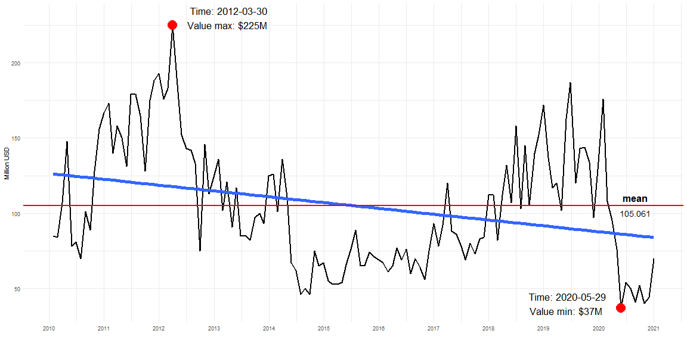
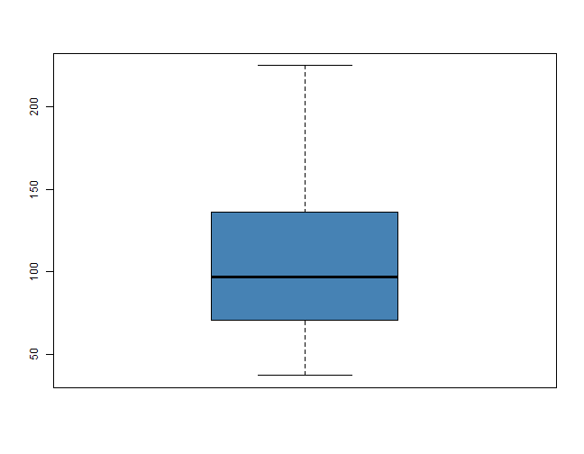
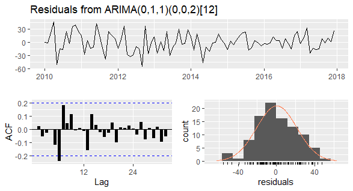

# PHƯƠNG PHÁP DỰ BÁO BẰNG SARIMA
========================================================

## Giới thiệu mô hình SARIMA
========================================================

Mô hình SARIMA là mô hình ARIMA nhưng được điều chỉnh được áp dụng cho những chuỗi thời gian có yếu tố mùa vụ: 

	SARIMA(p, d, q) (P, D, Q)m

Trong đó:
  - p, q lần lượt là bậc của quá trình tự hồi quy AR và trung bình trượt MA của chuỗi dữ liệu

  - d là bậc sai phân mà tại đó chuỗi là chuỗi dừng

  - P, Q lần lượt là bậc của quá trình tự hồi quy AR và trung bình trượt MA của chuỗi mùa vụ

  - D là bậc sai phân mà tại đó chuỗi mùa vụ là chuỗi dừng

  - m là số giai đoạn trong một chu kỳ

## Nội dung
========================================================

  - Tổng quan về dữ liệu nghiên cứu (thống kê mô tả, vẽ đồ thị, chia tách dữ liệu,...) 
  - Xây dựng mô hình SARIMA:
    - Kiểm tra tính dừng của chuỗi dữ liệu và chuỗi mùa vụ bằng kiểm định ADF
    - Lựa chọn các tham số cho mô hình
    - Ước lượng mô hình SARIMA từ các tham số tìm được, `auto.arima()` để tìm mô hình tốt nhất
    - Kiểm tra chuỗi phần dư
    - Dự báo và kiểm tra kết quả cho dữ liệu ngoài mẫu
  - Kết luận
  - Tải dữ liệu [tại đây](https://github.com/P-H-Phuc/Phantichdulieu/raw/main/VietnamGas.xlsx)
  
## Dữ liệu giá trị xuất khẩu xăng, dầu hoả của Việt Nam 2010 - 2020
========================================================



Quan sát chuỗi dữ liệu, nhìn chung có sự thay đổi giữa các năm từ 2010 - 2020, cụ thể:

  - Giá trị xuất khẩu xăng, dầu đạt giá trị lớn nhất là 225 triệu USD vào 2012-03-30; nhỏ nhất là 37 triệu USD vào 2020-05-29.
  - Từ năm 2010 - 2020, giá trị xuất khẩu xăng dầu có xu hướng giảm.
  
## Thống kê mô tả
========================================================

Kết quả thống kê mô tả giá trị xuất khẩu xăng, dầu hoả:

```
      time                value       
 Min.   :2010-01-29   Min.   : 37.00  
 1st Qu.:2012-10-22   1st Qu.: 70.75  
 Median :2015-07-15   Median : 97.00  
 Mean   :2015-07-15   Mean   :105.06  
 3rd Qu.:2018-04-06   3rd Qu.:136.00  
 Max.   :2020-12-31   Max.   :225.00  
```



Quan sát box plot, ta thấy rằng dữ liệu có phân phối lệch phải và không chứa giá trị ngoại lệ.

## Chia tách dữ liệu để xây dựng và kiểm tra mô hình
========================================================

Chia tập training/testing sao cho năm 2018 - 2020 sẽ được sử dụng làm dữ liệu test và dữ liệu còn lại được sử dụng để huấn luyện mô hình.


## Kiểm tra tính dừng của chuỗi dữ liệu training
========================================================

```
	Augmented Dickey-Fuller Test

data:  training
Dickey-Fuller = -2.5627, Lag order = 4, p-value = 0.3439
alternative hypothesis: stationary
```

*Với mức ý nghĩa 5%, ta kết luận rằng chuỗi dữ liệu gốc có nghiệm đơn vị và có tính chất không dừng.*

  - Khắc phục chuỗi không dừng bằng sai phân bậc 1

Ta thực hiện lấy sai phân bậc 1 của chuỗi training, sau đó kiểm định ADF để kiểm tra tính chất dừng:

```

	Augmented Dickey-Fuller Test

data:  diff_1
Dickey-Fuller = -4.3792, Lag order = 4, p-value = 0.01
alternative hypothesis: stationary
```

**Với kết quả trên, ta kết luận chuỗi dữ liệu là chuỗi dừng ở sai phân bậc 1 (d = 1).**

## Đồ thị chuỗi sai phân bậc 1
========================================================


  
  - Từ đồ thị PACF, các bậc của AR có thể có: p = {0, 1}

  - Từ đồ thị ACF, các bậc của MA có thế có: q = {0, 1, 5}

## Kiểm tra sự tồn tại tính mùa của chuỗi sai phân
========================================================

Để thực hiện ước lượng mô hình SARIMA thì chuỗi thời gian phải tồn tại yếu tố mùa vụ. Thực hiện WO-test để kiểm tra tính mùa trong chuỗi:

```
Test used:  WO 
 
Test statistic:  1 
P-value:  0.0007835722 0.01270625 0.001566043 
 
The WO - test identifies seasonality
```

**Kết quả kiểm định cho thấy chuỗi dữ liệu giá trị xuất khẩu xăng, dầu hoả tồn tại yếu tố mùa vụ.**

## Phân tách các yếu tố trong chuỗi sai phân
========================================================


## Kiểm tra tính dừng chuỗi mùa vụ
========================================================

```
	Augmented Dickey-Fuller Test

data:  component$seasonal
Dickey-Fuller = -3.6685, Lag order = 4, p-value = 0.03118
alternative hypothesis: stationary
```

**Với kết quả trên, ta kết luận chuỗi mùa vụ là chuỗi dừng (D = 0).**

## Lựa chọn tham số P, Q cho thành phần mùa AR, MA
========================================================


  - Từ đồ thị PACF: P = {0, 1}
  - Đồ thị ACF: Q = {0, 1}

## Lựa chọn mô hình SARIMA
========================================================

Từ những phân tích trên, ta thu được các tham số: p = {0, 1}; q = {0, 1, 5}; d = 1; P = {0, 1}; Q = {0, 1}. Một số mô hình SARIMA:
  - SARIMA (0, 1, 0) (1, 0, 0) [12]
  - SARIMA (0, 1, 1) (1, 0, 1) [12] 
  - SARIMA (1, 1, 0) (1, 0, 1) [12]
  - SARIMA (1, 1, 1) (1, 0, 1) [12]
  - SARIMA (0, 1, 0) (0, 0, 0) [12]
  - ...

## Chạy mô hình mẫu
========================================================

Giả sử chọn mô hình SARIMA(0, 1, 0)(1, 0, 0)[12]

```
Series: training 
ARIMA(0,1,0)(1,0,0)[12] 

Coefficients:
        sar1
      0.2646
s.e.  0.1066

sigma^2 estimated as 503.9:  log likelihood=-430.3
AIC=864.6   AICc=864.73   BIC=869.71

Training set error measures:
                   ME     RMSE      MAE       MPE     MAPE     MASE       ACF1
Training set 0.227419 22.21359 16.86878 -1.841731 17.09018 0.498059 -0.2678051
```

**Thực hiện chạy các mô hình SARIMA, sau đó chọn mô hình tốt nhất thông qua AIC.**

## Lựa chọn mô hình SARIMA
=========================================================

|NameModel                         |AIC     |BIC     |RMSE   |MAPE   |
|:---------------------------------|:-------|:-------|:------|:------|
|SARIMA c(0, 1, 1) c(1, 0, 1) [12] |853.713 |863.929 |19.953 |16.683 |
|SARIMA c(1, 1, 1) c(1, 0, 1) [12] |855.537 |868.307 |19.958 |16.7   |
|SARIMA c(1, 1, 0) c(1, 0, 1) [12] |855.697 |865.913 |20.266 |16.607 |
|SARIMA c(0, 1, 1) c(1, 0, 0) [12] |857.492 |865.154 |21.194 |16.441 |
|SARIMA c(1, 1, 1) c(1, 0, 0) [12] |858.593 |868.809 |21.077 |16.618 |
|SARIMA c(0, 1, 1) c(0, 0, 1) [12] |858.645 |866.306 |21.356 |16.528 |
|SARIMA c(0, 1, 1) c(0, 0, 0) [12] |859.089 |864.197 |21.661 |16.681 |
|SARIMA c(1, 1, 0) c(1, 0, 0) [12] |859.312 |866.974 |21.403 |16.166 |
|SARIMA c(1, 1, 1) c(0, 0, 1) [12] |859.924 |870.14  |21.263 |16.706 |
</center>

**Mô hình có chỉ số AIC nhỏ nhất là SARIMA (0, 1, 1) (1, 0, 1) [12]**

## `auto.arima()` function
========================================================

  - Lựa chọn mô hình

```
Series: training 
ARIMA(0,1,1)(0,0,2)[12] 

Coefficients:
          ma1    sma1    sma2
      -0.3524  0.1701  0.2083
s.e.   0.1076  0.1132  0.1069

sigma^2 estimated as 451.9:  log likelihood=-424.39
AIC=856.77   AICc=857.22   BIC=866.99

Training set error measures:
                    ME     RMSE     MAE       MPE     MAPE      MASE       ACF1
Training set 0.2593003 20.81134 16.3525 -2.089171 16.37493 0.4828156 0.02273757
```

Với kết quả bên trên, cho thấy mô hình <b> SARIMA (0,1,1)(0,0,2)[12] </b> là mô hình tốt nhất.

Ta sử dụng mô hình này để thực hiện các kiểm định liên quan và thực hiện dự báo.

## Kiểm tra ý nghĩa thống kê của hệ số hồi quy
========================================================

```

z test of coefficients:

     Estimate Std. Error z value Pr(>|z|)   
ma1  -0.35241    0.10762 -3.2748 0.001058 **
sma1  0.17006    0.11322  1.5020 0.133110   
sma2  0.20826    0.10689  1.9484 0.051369 . 
---
Signif. codes:  0 '***' 0.001 '**' 0.01 '*' 0.05 '.' 0.1 ' ' 1
```

**Kết quả cho thấy, ta chấp nhận rằng hệ số ma1 và sma2 có ý nghĩa thống kê ở mức 5%, hệ số sma1 có ý nghĩa thống kê ở mức 10%.**

## Dự báo bằng SARIMA(0,1,1)(0,0,2)[12]
========================================================


```
                    ME     RMSE     MAE       MPE     MAPE      MASE       ACF1
Training set 0.2593003 20.81134 16.3525 -2.089171 16.37493 0.4828156 0.02273757
```

## Kiểm tra chuỗi phần dư
========================================================

```

	Ljung-Box test

data:  Residuals from ARIMA(0,1,1)(0,0,2)[12]
Q* = 18.249, df = 16, p-value = 0.3095

Model df: 3.   Total lags used: 19
```

**Chuỗi phần dư là chuỗi nhiễu trắng, không có tự tương quan bậc 1. Mô hình SARIMA này dự báo tốt.**

<center></center>

## Dự báo ngoài mẫu
========================================================


## Kiểm tra kết quả dự báo
=========================================================


Sai số dự báo RMSE: ```18.888```

## Dự báo cho năm 2021
=========================================================


## Kết luận 
=========================================================

  - Kết quả cho thấy mô hình dự báo SARIMA đáng tin cậy và dự báo tốt trong ngắn hạn. Mô hình có thể được
dùng để dự báo giá trị xuất khẩu xăng, dầu hoả cho các giai đoạn tiếp theo, khi dữ
liệu được cập nhật.

  - Tuy nhiên, trên thực tế còn có rất nhiều yếu tố tác động đến giá trị xuất khẩu xăng dầu, trong đó có những yếu tố rất khó xác định và thường xuyên biến động (cung cầu, dịch bệnh, tỷ giá,...), hơn nữa giữa các yếu tố này còn có sự tác động qua lại lẫn nhau ở một độ trễ nhất định. Chính vì thế việc dự báo sẽ tồn tại những sai số nhất định. 

  - Việc sử dụng mô hình SARIMA là chưa đủ để có thể đo lường chính xác sự biến động. Để tăng độ chính xác cho kết quả dự báo, cần kết hợp nhiều mô hình khác nhau để đo lường hoặc sử dụng những mô hình nâng cao như mô hình ARCH, GARCH, VaR để phân tích.
